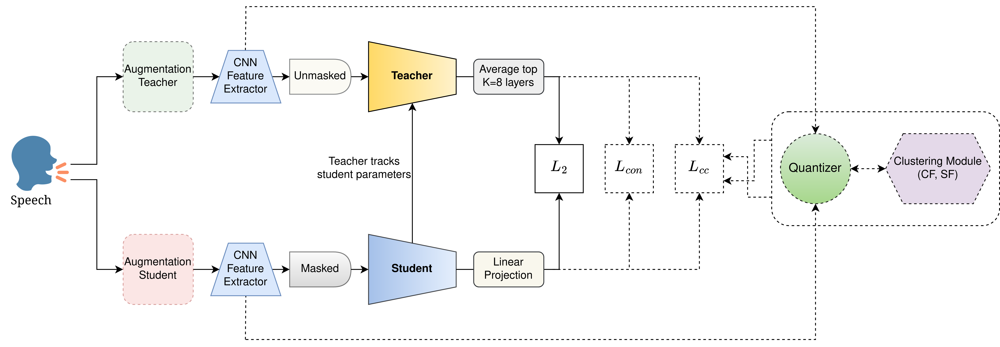
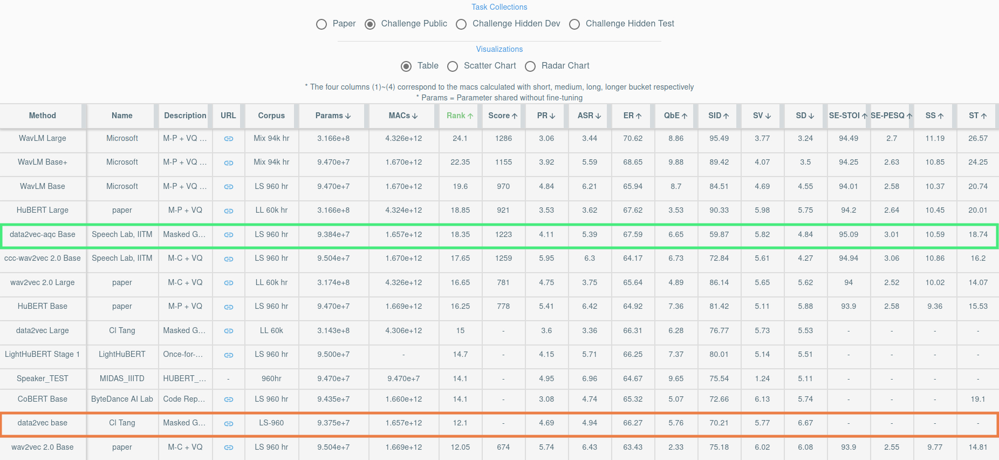

# [data2vec-aqc](https://arxiv.org/abs/2211.01246)

Paper Title: data2vec-aqc: Search for the right Teaching Assistant in the Teacher-Student training setup. Submitted to ICASSP 2023 ([arxiv link](https://arxiv.org/abs/2211.01246)).

data2vec-aqc is a Self-Supervised Learning (SSL) algorithm for speech representation learning from unlabeled speech data. Our goal is to improve SSL for speech in domains where both unlabeled and labeled data are limited. Building on the recently introduced data2vec, we introduce additional modules to the data2vec framework that leverage the benefit of data augmentations, quantized representations, and clustering. The interaction between these modules helps solve the cross-contrastive loss as an additional self-supervised objective.

<p align="center">
  
</p>

Primary Contributions:
* We make data2vec simultaneously solve a masked acoustic modeling based cross-contrastive task between the student and teacher networks by passing randomly augmented version(s) of the same audio sample passed through each network.
* We add a quantizer module similar to wav2vec 2.0, as sampling negatives from the quantized representations has been proven to be effective.
* Additionally, we introduce a clustering module from ccc-wav2vec 2.0, to cluster the quantized representations and diminish the effect of negatives in the contrastive loss computation that fall into the same cluster as the positive.

## SUPERB Benchmark

The data2vec-aqc BASE model pre-trained on LibriSpeech-960h has been evaluated on the multiple downstream tasks over the [SUPERB benchmark](https://superbbenchmark.org/leaderboard?subset=Public+Set). The proposed method comprehensively outperforms the baseline data2vec BASE model over the array of downstream tasks presented over SUPERB.

<p align="center">
  
</p>

## Models
The WERs specified are without the use of any language model.

Model | Pre-training data | Fine-tuning data | Model Link | WER (test-clean \| test-other)
|---|---|---|---|---
wav2vec Base | LibriSpeech-360h | No fine-tuning | [download](https://drive.google.com/file/d/1nM4DLwTP62Iu5yOeGgdmekDh4OFZeNCp/view?usp=share_link) | ---
wav2vec Base | LibriSpeech-360h | LibriSpeech-100h | [download](https://drive.google.com/file/d/1qhAa5_4eXutegp6fEAX2Ap0tIGZPWskL/view?usp=share_link) | 7.5 \| 20.2
data2vec Base | LibriSpeech-360h | No fine-tuning | [download](https://drive.google.com/file/d/1jlgMvQ9ssEjEGme4Q-lSpJ4TYCaqrVq0/view?usp=share_link) | ---
data2vec Base | LibriSpeech-360h | LibriSpeech-100h | [download](https://drive.google.com/file/d/1VwpO_caMEYLqb4yqftH9cgqDQhHGfmZe/view?usp=share_link) | 6.4 \| 17.7
data2vec-aqc Base | LibriSpeech-360h | No fine-tuning | [download](https://drive.google.com/file/d/1OUZjib4tkdxt_2nHfdEyEbyic3_rbCOH/view?usp=share_link) | ---
data2vec-aqc Base | LibriSpeech-360h | LibriSpeech-100h | [download](https://drive.google.com/file/d/1ayCrZ2zM3GhZMhNEj0mPJp74pHq37Tmz/view?usp=share_link) | 5.5 \| 14.0
data2vec-aqc Base | LibriSpeech-960h | No fine-tuning | [download](https://drive.google.com/file/d/1H35MHmUW8qjkhICA233wPE7QXPTJiT6R/view?usp=share_link) | ---
data2vec-aqc Base | LibriSpeech-960h | LibriSpeech-100h | [download](https://drive.google.com/file/d/1ydgk1m0E5UEZniD5CWN_PAIHrMePftzk/view?usp=share_link) | 4.8 \| 9.5
data2vec-aqc Base SUPERB | LibriSpeech-960h | No fine-tuning | [SUPERB benchmark submission](https://drive.google.com/file/d/1-Q7CVsBPUIXt91qLoXiRriAj9wNl_bgx/view?usp=share_link) | ---

* Pre-training and fine-tuning procedures can be found [here](https://github.com/Speech-Lab-IITM/data2vec-aqc/examples/data2vec).

## Requirements and Installation

* [PyTorch](https://pytorch.org/) version >= 1.10.0
* Python version >= 3.8
* For training new models, you'll also need an NVIDIA GPU and NCCL
* To install fairseq with data2vec-aqc and develop locally:

``` bash
git clone https://github.com/Speech-Lab-IITM/data2vec-aqc
cd fairseq
pip install --editable ./
```

* **For faster training** install NVIDIA's [apex](https://github.com/NVIDIA/apex) library:

``` bash
git clone https://github.com/NVIDIA/apex
cd apex
pip install -v --no-cache-dir --global-option="--cpp_ext" --global-option="--cuda_ext" \
  --global-option="--deprecated_fused_adam" --global-option="--xentropy" \
  --global-option="--fast_multihead_attn" ./
```

* **For large datasets** install [PyArrow](https://arrow.apache.org/docs/python/install.html#using-pip): `pip install pyarrow`
* If you use Docker make sure to increase the shared memory size either with `--ipc=host` or `--shm-size`
 as command line options to `nvidia-docker run` .

* **For Augmentations** to work install [torchaudio-augmentations](https://github.com/Speech-Lab-IITM/torchaudio-augmentations): 
```bash
git clone https://github.com/Speech-Lab-IITM/torchaudio-augmentations
cd torchaudio-augmentations
pip install --editable ./
```

* The clustering module functions on GPU needs **fast-pytorch-kmeans** to be installed: `pip install fast-pytorch-kmeans`

## Parameters of interest

* The `cluster_factor` and `scale_factor` parameters (for the clustering module) can be modified from the `model` section of the pre-training configs which can be found from the [pre-training config](https://github.com/Speech-Lab-IITM/data2vec-aqc/examples/data2vec/config/audio/pretraining).
* The augmentations used for data2vec-aqc requires the noise set of MUSAN dataset. The path to the same is to be specified in the `path_to_musan_noise_set` variable of the __getitem__ method of the [raw_audio_dataset](https://github.com/Speech-Lab-IITM/data2vec-aqc/fairseq/data/audio/raw_audio_dataset.py) file.

## Reference Code
1. Facebook AI Research Sequence-to-Sequence Toolkit written in Python. [fairseq](https://github.com/facebookresearch/fairseq)